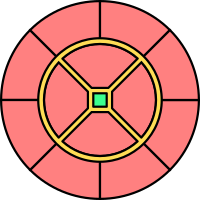

# Premise
A golden age of space exploration fueled by sex-based magical technology has lead to the rapid expansion and construction of orbital space stations on the frontier of space, populated by a wide variety of anthropomorphic species. Since the post-scarcity inhabited planets are free and equitable with a high standard of living, the new space stations have trouble attracting permanent residents. Many space stations become ghost towns after the surrounding space is explored and people lost interest. The explorers’ nomadic lifestyles are stressful, unpredictable, and isolating, leading to burnout and reckless behavior. A growing problem is these explorers falling victim to vices, violence, and exploitation in the fringes of settled space. 

To combat both these issues, a newly-build orbital station joined a pilot program to build a dedicated recreation/red-light district. Towards explorers, the program seeks to give them a safe outlet for stress, and incentive to at visit civilization for companionship and relationships. Towards planet-bound people, the facilities would help bring the standard of living and entertainment up to parity and entice people to resettle on the station. For both, permanent residence, population growth through births, and the magical products of sex go towards establishing the station as a permanently-inhabited city.
# Gameplay Overview
This game is primarily a colony sim and sexual sandbox. The player is a facilities manager designing and constructing this new red-light district. The station is comprised of stacks of circular decks, where the player may place furniture, sex toys, décor and other entertainment into rooms. These attracts guests to use them for sexual activity, either alone or with others, or interact with other guests in non-sexual areas. The behavior of guests is determined by their internal preferences (specific fetishes or sex acts, their sexual preferences towards other guests, and preferences for atmosphere and amenities) as well as their state (hunger, lust, thirst, social need, patience/interest, remaining free time). For example, one of the starting facilities is a set of penis milkers, which provides intense but short-lived penile stimulation. Most guests would only consider it if they are low on time and would like to orgasm quickly. However, guests with relevant fetishes/preferences, such as for strong stimulation/overstimulation, cum play, machinery, or studding may choose to use them even if they have available time to use other options. As the station grows and gains reputation, guests' expections and interests grow and become more varied, requiring the player to upgrade and expand their offerings. The player may shape the guest's desires towards the sexual content they wish to see in the game by building the relevant objects. The player may also direcly set the sexual content they wish to see more/less/none of as a game option, stylized in-game as "advertizing".

Sex acts produce the three main “currencies” of the game; fluids, energy, and essence (in order of decreasing frequency). These are used exchanged or expended to build, maintain, upgrade and research objects, or sent to the rest of the station for various bonuses, offscreen improvements, and to expand available space. Certain sex actions will use these resources for certain fetish-related content, such as transformation or impregnation. Satisfying guests’ desires increases their satisfaction rating, draws more guests seeking similar attractions, and novel attractions may produce endorsements, a secondary resource. Guests who have a high satisfaction score visit again, or settle on the station, increasing the station population. Satisfaction scores, usership numbers, station population, and endorsements are the primary milestones for unlocking new objects and additional space.

To aid in maintaining the area and providing services, the player may recruit staff members. A pool of applicants is generated from returning guests or the station population, with a few selected from new guests or generated outright. In order for staff to perform more than the bare basics, the player must build designated staff rooms, such as janitor closets and machinery shops. Examples of roles a staff member may take include mechanic, janitor, receptionist, maid/butler/attendant, chef, dancer, and prostitute. Staff satisfaction increases their performance, and is increased by assigning duties that fit their aptitudes and interests, and by allowing them to use the facilities, and by maintaining good working conditions. Staff gain experience towards relevant as they work, and may also be trained to perform faster, and on more advanced tasks. The number of staff is limited by available space, and training requires resources that accumulate slowly (such as essence), so the player must balance roles and time against the staffing requirements of the facilities they build, and balance space for staff support against space for guests. Facilities with high capacity relative to their space, or that perform specialized tasks, require more staff attention and specialization.

Various factions have an interest in the project, desiring that the player focus on specific kinds of amenities. Each faction is associated with a specific area of content, whether sexual (breeding, machinery, transformation, BDSM, etc) or gameplay/setting (such as the factions representing station management, research, culinary promotion, the explorers' guild, etc.). These factions will send a small retinue of special representive NPCs, through which the player will receive requests (quests), such as to build specific relevant facilities or have guests perform certain sex acts. These factions are intended as a secondary system for the player to tailor their experience. Following requests and building reputation with a faction unlocks new objects associated with their content, and increases the guests drawn towards that content. On the other hand, a (sex-related) faction's content can be suppressed/re-allowed at will by talking to their representative. Faction representatives would also be the majority of the game's romancable characters.
# Themes and Sexual Content
Sexual acts performed by guest/staff NPCs are by design limited by the objects the player builds, and by the guests' preferences via the "advertisement" and faction systems. This way, built-in (or potentially mod-added) sexual content (with a few exceptions) is very modular and can be added/removed from a player's experience easily.

The following content is considered fundamental, and cannot be removed from the game without a drastic rework of the game concept:
- Sex toys and machinery
- Casual sex
- Sex work
- Fluid play with cum, vaginal fluids, milk
- Sex magic
 
The following content is considered core, meaning that the game's content will be written expecting that a player would have much or all enabled:
- Anthros (furries/scalies)\* and fantasy creatures
- Polysexuality (e.g. orgies)
- Breeding/Impregnation/Pregnancy
- BDSM
- Roleplaying
- CNC/roleplay of coercive situations\*\*
- Primal play
- Nudism, exhibitionism, voyeurism, public sex
- Transformation
	- Growth/Shrinkage
	- Extra parts
	- TGTF
	- Species transformation (both full and partial)
- Unusual Body Forms
	- Taur, Lamia, etc.
	- Tentacles
	- Body materials (Slime, Fungus, Plantfolk, Plush, Latex, Candy, Crystal, etc.) 
	- TF for above (reversible)
- Corruption/Demonification (a la CoC, FS; reversable)
- Hypnosis, consensual mild control\*\*
	- Trance/altered states
	- Orientation play
	- Intoxication, substance play
	- Drone/Mindlink

\* The player will be allowed to control the species rarities that newly-generated guests will spawn as, including all-human if so desired

\*\* This game is inspired by games including Corruption of Champions, Trials in Tainted Space, Lilith's Throne, Flexible Survival, Grove RPG/Prowler, and Broken Dreams Correctional Center. However, I would like for this game will steer away from the grim or dystopian themes common in those settings/bad-ends, as much as I like those games. As such, these situations will be explicitly fully consensual experiences negotiated beforehand.

Extreme fetish content such as guro/extreme violence, scat, vore, and under/questionable age, is not, and will never be, a part of this game.
# Core Gameplay Concepts

## Station Layout
The game takes place aboard a orbital space station, above an uninhabited planet. The player controls the part of the station dedicated to the red-light district. This part is cylindrical, consisting of a stack of circular floors, and attached to the rest of the spherical station at the base. The rest of the station (such as life support, and unrelated habitation, industry, and transportation) is left abstract and not shown in gameplay.

The space station consists of a stack of circular decks (or floors), built in a radial pattern around a central trunk. The center of each floor is a elevator/transporter landing, where characters converge to travel between Decks.

 The deck is divided into blocks, shown in red on the figure. Wedge-shaped blocks are arranged around the center, while the outer ring of the deck is divided into annular-segment ("rectagular") blocks. \[[Figure shown is a deck layout with 4 wedge blocks and 8 rectangle blocks. These numbers TBD.]\] A set of corridors (yellow in figure) used by characters to travel around the floor separate the wedge segments and form a ring on the inner edge of the rectangle blocks. [[Figure not to scale, dimensions of blocks TBD.]\] The wedge blocks are approximately 16 meters radially (along the straight edge), while the rectangular blocks are approximately 12 radially.

The player may select one or more adjacent Blocks as a room, designating that space for a specific purpose and choosing a room type for it. Examples of room types include: lounge, dormitory, sex room, bath rooms, kitchens, and dining rooms. The player also chooses a room layout, which determines the placement of walls, dividers, walkways and object slots in that room. Rooms may be a single space (such as a for a large lounge area), or subdivided into smaller each treated as its own space. To be considered functional, a the objects in a room must meet the requirements for that room type. Once functional, staff and guest NPCs will enter the room to perform interactions with the objects and each other. Each room tracks theming, privacy, and attractions/fetishes, based on the objects in the room and the actions available in the room. Guests will be attracted to or ignore rooms based on their preferences. As guests fill up and use the room, they react to the crowdedness and noise within the room and the condition of the objects within.
Object slots are positions on the floor and walls of the room, where objects such as furniture, decor, machinery/appliances may be placed. Each object slot may have restrictions on the size, form factor and function of the object. For example, a basic dormitory room will be divided into smaller bedroom subrooms. Each bedroom will have at least one slot on the floor for the bed, with smaller slots to the side and on the walls for different furniture.

Multiple adjecent rooms can be designated as a suite/spectialty segment, a collection of rooms that fit a larger purpose. Examples of suite designations include refreshment hall, spa, nightclub, hotel and brothel. The rooms within a suite may be varied. For example, a "spa" segment would have rooms related to health and wellness, and may include a hot pool room, a swimming pool room, a massage room, a minigym, and a juice bar. Designating a segment confers bonuses to the rooms, including higher efficiency of staff working in the rooms, drawing more interested guests to the segment, and increasing the satisfaction and yields from guests.

See additional documentation for a listing of planned rooms.

### Special Areas
Two decks are set aside with pre-set rooms for special purposes.

One deck will be pre-set as the "administration deck", which contains the player's office, a staff office, and the player's quarters. The player character occupies this office to plan and order construction, view statistics and information, and manage staff and guests, and manage bookings and reservations, and exchange/spend resources. Story NPCs, such as faction heads, use the office as a meeting point for interacting with the player. The player may also invite characters to their quarters for interactions including sex, if they can't or do not wish to use the general facilities. The center of the deck is a "station core", a magical construct distributing power. This, and the player's quarters, are largely cosmetic for the player to customize.

One deck will be pre-set as the "entrance deck", where characters enter or exit the game area. The special rooms ringing the deck represent the entryways from the space station's docking area, or to the rest of the station. The center of the deck is ringed by a reception area.

### Construction Menu
In order to build/modify/move/destroy rooms and objects, the player enters into a construction mode. \[[TBD Paused during this mode? Live editing or commit?\]]. This allows to player to select and view rooms/room slots or objects. Selecting a room or room slot shows the properties of the room and a list of its objects. Selecting an object shows the properties of the object.

Placing a room or object creates the unbuilt object at the location (shown as a translucent outline). Before becoming operational, the object must be constructed by a staff character in a builder role. Before being constructed, the area taken up by the unbuilt object cannot be walked over. A room will not be considered

Construction of a new room:
1. Select empty room slot(s)
2. Layout Button (as Room Button) -> New Room Menu
3. New Room Menu: select room type, room layout, optionally properties and segment membership.
	 - Allow players to place objects at this time?
	 - Allow players to choose walls/partitions, selected layout permitting
4. Player exits New Room Menu by accepting or canceling
5. New room placed, unbuilt

### Room Properties
## Characters